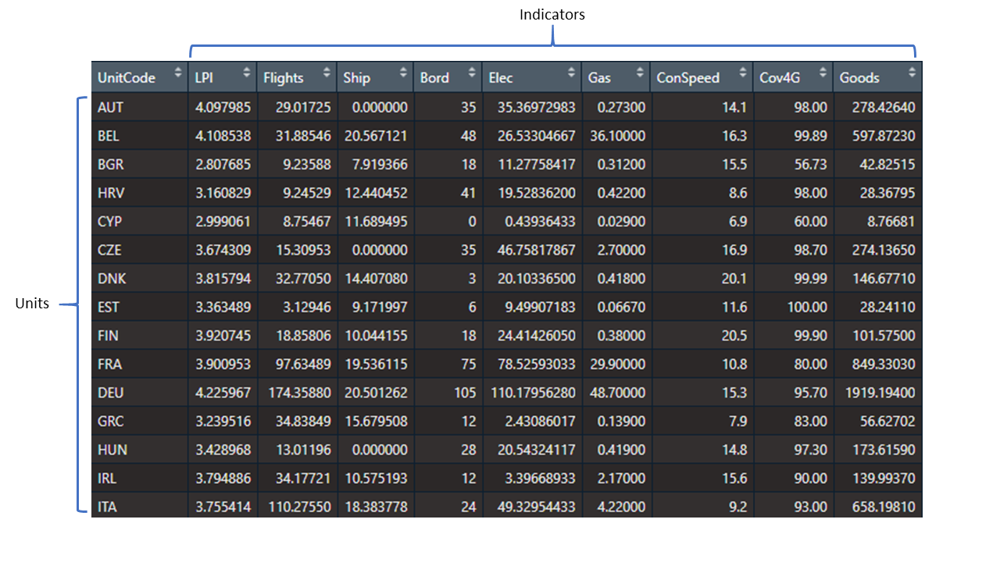
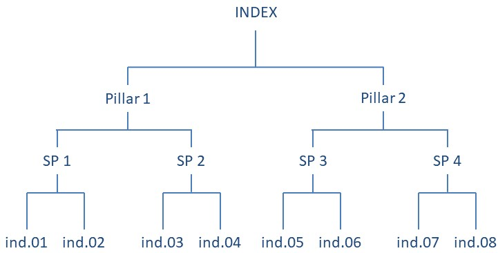

# Foundations

This chapter aims to explain some important principles about how COINr works, and explain some terminology. It also gives a map of the functions available in the package. If you want to get straight to using COINr, you could skip this chapter for now and look at some examples in the appendices or directly at the chapters relating to specific functions and operations (the next chapter onwards).

## Terminology

Let's clearly define a few terms first to avoid confusion later on.

+ An *indicator* is a variable which has an observed value for each unit. Indicators might be things like life expectancy, CO2 emissions, number of tertiary graduates, and so on.

+ A *unit* is one of the entities that you are comparing using indicators. Often, units are countries, but they could also be regions, universities, individuals or even competing policy options (the latter is the realm of multicriteria decision analysis).

Together, indicators and units form the main input data frame for COINr (units as rows, and indicators as columns):

```{r echo=F, fig.align = 'center', out.width = "100%", fig.cap = "Indicators and units"}

```

*Composite indicators* are created by aggregating multiple indicators into a single value. This may often be repeated more than once, following a hierarchical structure, such as the following figure:

```{r echo=F, fig.align = 'center', out.width = "100%", fig.cap = "Example of composite indicator structure."}

```

In this example, four pairs of indicators are each aggregated into a "sub-pillar", and sub-pillars are aggregated into two "pillars". Finally, the pillars are aggregated into a single index. Typically, the sub-pillars and pillars represent specific sub-concepts of the central concept. For example, in the [Global Innovation Index](https://www.globalinnovationindex.org/Home), which aims to measure innovation at the national level, pillars include things like "Institutions", "Human Capital", and "Infrastructure", each of which are populated with indicators which measure those specific concepts. The idea is that a complex multidimensional concept is broken down into sub-concepts which are easier to capture with a set of indicators. Additionally, the scores of pillars and sub-pillars can be interesting in their own right.

Whether each of these groups is called a "pillar", "sub-index", "dimension", or something else, depends on the index and your own favourite words. For this reason, in COINr a more general terminology is adopted.

When a group of indicators is aggregated together to form a single sub-pillar, pillar or otherwise, this is called an *aggregation group*. For example, the aggregation group of "SP 1" in the diagram above consists of "ind.01" and "ind.02". The aggregation group of "Pillar 1" consists of "SP 1" and "SP 2". And so on. The resulting value from aggregating an aggregation group is called an *aggregate* or *aggregate value*.

COINr also frequently refers to *aggregation levels* or equivalently just *levels*. This refers to the vertical position in the hierarchy shown above. In this example, therefore, 

* Level 1 = Indicators
* Level 2 = Pillars
* Level 3 = Sub-indexes
* Level 4 = Index

This means that the fictional index above has four levels in total. COINr can handle any number of levels and aggregation groups. The structure of the index is defined when the COIN is constructed - see the following chapter for details.

## COINr syntax

Many COINr functions follow a common syntax which is related to some of the terminology described above.

* `dset` always refers to the name of the data set that is found in `.$Data`. For example, `dset = "Normalised"` will return `.$Data$Normalised`. The only exception is `dset = "Denominators"`, which returns `.$Input$Denominators`. The argument `dset` is used in many COINr functions because they have to know which data set to operate on.
* `icodes` is a character vector of indicator or aggregate codes
* `aglev` is the aggregation level, or levels, to take the indicator data from. To understand how this works, see [Selecting data sets and indicators].
* `out2` controls the output of many functions - if set to "COIN" it will append the results back to the COIN that was input to the function, otherwise if "df" or "list" it will return the results as a data frame or list depending on the function.

In particular, the combination of `icodes` and `aglev` is useful because it allows to call sets of indicators inside aggregation groups very quickly. See [Selecting data sets and indicators] for more details.

## A map of COINr

COINr consists of many functions that do a number of different types of operations. Here is a summary.

### Construction

The following functions are the main functions for building a composite indicator in COINr.

Function            Description                                 
------------------  ---------------------------------------------
`assemble()`        Assembles indicator data/metadata into a COIN
`checkData()`       Data availability check and unit screening
`denominate()`      Denominate (divide) indicators by other indicators
`impute()`          Impute missing data using various methods
`treat()`           Treat outliers with Winsorisation and transformations
`normalise()`       Normalise data using various methods
`aggregate()`       Aggregate indicators into hierarchical levels, up to index
`regen()`           Regenerates COIN results using specifications stored in `.$Method`

### Visualisation and presenting

These functions are for visualising and presenting data and results

Function            Description                                 
------------------  ---------------------------------------------
`iplotBar()`        Interactive bar chart for any indicator, includes stacked bar charts
`iplotCorr()`       Interactive correlation heatmap
`iplotIndDist()`    Interactive indicator distribution plots for a single indicator
`iplotIndDist2()`   Interactive indicator distribution plots for two indicators simultaneously
`iplotMap()`        Interactive choropleth map for any indicator (only works for countries)
`iplotRadar()`      Interactive radar chart for specified unit(s) and specified indicators
`iplotTable()`      Interactive results table with conditional formatting
`plotCorr()`        Correlation heatmap between any levels/groups of the index
`plotframework()`   Interactive sunburst plot visualising the indicator framework
`plotIndDist()`     Static plot of distributions for indicators and groups of indicators
`plotSA()`          Plot sensitivity analysis results (sensitivity indices)
`plotSARanks()`     Plot confidence intervals on ranks, following an uncertainty/sensitivity analysis
`colourTable()`     Conditionally-formatted interactive HTML table, given a data frame
`getResults()`      Gets quick results summary tables
`getStrengthNWeak()`Gets strengths and weaknesses (N top ranked indicators) of a selected unit
`getUnitReport()`   Generates a unit report following a template, and outputs either HTML, Word or pdf format
`getUnitSummary()`  Summarises scores and ranks of a selected unit, at specified aggregation levels 

### Adjustment and comparison

Function            Description                                 
------------------  ---------------------------------------------
`compTable()`       Comparison table of selected indicator/aggregate between two COINs
`compTableMulti()`  Comparison table of selected indicator/aggregate between multiple COINs
`indChange()`       Short cut to add or remove indicators


### Analysis

The following functions analyse indicator data.

Function            Description                                 
------------------  ---------------------------------------------
`getCorr()`         Get correlation matrices between various groups and levels
`getCronbach()`     Get Cronbach's alpha for specified group/level
`getPCA()`          Principle component analysis on a specified data set and subset of indicators. Also returns PCA weights.
`effectiveWeight()` Calculates the effective weights of each element in the indicator hierarchy.
`getStats()`        Get table of indicator statistics for any data set
`hicorrSP()`        Identify highly correlated indicators in the same aggregation group
`outrankMatrix()`   Outranking matrix based on a data frame of indicator data and corresponding weights
`removeElements()`  Reports the impact of sequentially removing indicators or aggregates
`sensitivity()`     Perform a Monte Carlo uncertainty analysis and/or a global sensitivity analysis on a COIN
`weightOpt()`       Weight optimisation according to a pre-specified vector of "importances"


### Interactive apps

These are interactive apps, built using Shiny, which allow fast interactive exploration and adjustments.

Function            Description                                 
------------------  ---------------------------------------------
`indDash()`         Indicator visualisation (distribution) dashboard for one or two indicators
`rew8r()`           Interactively re-weight indicators and check updated results and correlations
`resultsDash()`     Interactive dashboard for visualising and exploring results

### Import/export

Functions to import and export data and results to and from COINr and R.

Function            Description                                 
------------------  ---------------------------------------------
`COINToolIn()`      Import indicator data and metadata from COIN Tool
`coin2Excel()`     Write data, analysis and results from a COIN to Excel

### Other functions

These are other functions that may be of interest, but do not neatly fit in the previous categories. Many of them are called from the other functions listed above, but may still be useful on their own.

Function            Description                                 
------------------  ---------------------------------------------
`BoxCox()`          Box Cox transformation on a vector of data
`build_ASEM()`      Build ASEM (example) composite indicator in one command
`coin_win()`        Winsorise one column of data according to skew/kurtosis thresholds
`compareDF()`       Detailed comparison of two data frames (e.g. for cross checking external calculations)
`copeland()`        Aggregates a data frame into a single column using the Copeland method.
`geoMean()`         Weighted geometric mean of a vector
`getIn()`           Useful function for subsetting indicator data. See [Helper functions].
`harMean()`         Weighted harmonic mean of a vector
`is.coin()`         Check if object is a COIN
`loggish()`         Log-type transformation, of various types, for a vector
`names2Codes()`     Given a character vector of long names (probably with spaces), generates short codes.
`rankDF()`          Convert a data frame of scores to ranks (non-numerical columns are ignored)
`replaceDF()`       Simultaneously replace multiple values in a data frame. Useful for converting categorical variables to numerical.
`roundDF()`         Round down a data frame (i.e. for presentation)


### Data

COINr comes with some example data embedded into the package.

Function            Description                                 
------------------  ---------------------------------------------
`ASEMIndData`       ASEM (example) indicator data as input for `assemble()`
`ASEMIndMeta`       ASEM (example) indicator metadata as input for `assemble()`
`ASEMAggMeta`       ASEM (example) aggregate metadata as input for `assemble()`
`WorldDenoms`       National denomination data (GDP, population, etc) worldwide

### Finally

There are also a number functions which are mainly for internal use, and are not listed here.

## Tips for using COINr

### Use scripts and R Markdown

Like any good data science, anything you do in COINr should be reproducible. This means that ideally, you should be able to go from importing the data into R up to visualising the results. This can be either done by a script or a set of scripts, or perhaps better using an R markdown document or documents which combines text with code. If you haven't used R Markdown before, you probably should be using it. It is very similar to the idea of Jupyter notebooks in Python. Find out more about R Markdown in the free and excellent online book [R Markdown: The Definitive Guide](https://bookdown.org/yihui/rmarkdown/). You might also notice that this manual is written in R Markdown, and more specifically using the [bookdown package](https://bookdown.org/yihui/bookdown/).

Ideally, the whole process of building and analysing the composite indicator should be documented with an R Markdown file or files, or scripts. Apart from reproducibility, this makes it very easy to make retrospective changes and update the whole file. I have personally found that it may help to have several markdown notebooks - one for exploring the data and selecting indicators, another for data treatment, and another for construction, and so on. At the end of each notebook, the COIN(s) containing all data and analysis are saved to a folder and loaded back in in the next notebook. This avoids having one very long notebook. Of course, this is just one way of doing things and is just a suggestion.

### Missing data

It's very important to understand the difference between missing data and zeros. A zero means that you know that the value of the indicator is zero, whereas missing data (in R this is denoted as `NA`) means you don't know what the value is at all.

When aggregating indicators, this difference becomes particularly important. If a data point is missing, it is often excluded from the aggregation, which effectively means reassigning it with the mean (or similar) value of the indicators in the same group. If you impute the data, missing values could be assigned with mean or median indicator values, for example. Clearly, these values will be very different from zeros.

This point is made here, because data may sometimes come with missing values denoted as zeros, or with zeros denoted as missing values. Ensure that these are checked carefully before proceeding with construction.

### Plotting

COINr includes a number of plotting functions which return various types of plots. These are all either based on the ggplot2 or plotly packages. Think of COINr plots as "starting points" rather than finished plots. While I have tried to make the plots useful and even visually appealing, much more could be done to improve them and to fit particular uses and contexts.

Luckily, because of the way that plotly and ggplot2 work, plots generated by COINr can easily be modified by assigning them to an object and then modifying the object. Generally this would look like this:

```{r modifyPlotGeneric, eval=F}
# generate a plot, but assign to variable "plt"
plt <- COINr_plot_function(COIN, plot_options)

# alter plt
plt <- plt + alter_plot_function(options)

# view the plot
plt
```

The `alter_plot_function` could be any of the very many layout and geometry functions from ggplot2, for example. This means you can change colours, axis labels, point styles, titles and many other things.

In summary, with COINr you may choose to either:

* Generate plots with COINr functions and be content with them as they are
* Generate plots with COINr functions and tweak them to your tastes using the approach shown above
* Make your own plots

### Panel data and multiple COINs

Currently COINr does not explicitly support panel data, although the `assemble()` function can extract and impute a single year of data from a panel data set. If you wish to work with panel data, I would recommend to build a separate COIN for each point in time, and store the COINs in a list. This makes it easy to apply COINr functions to all COINs in one go using purrr or `lapply()` functions. It is also more flexible to use separate COINs because methodology, units and indicators may vary from one year to the next.

The same strategy can be applied any parallel development of multiple indexes, such as separate indexes for country groups.
