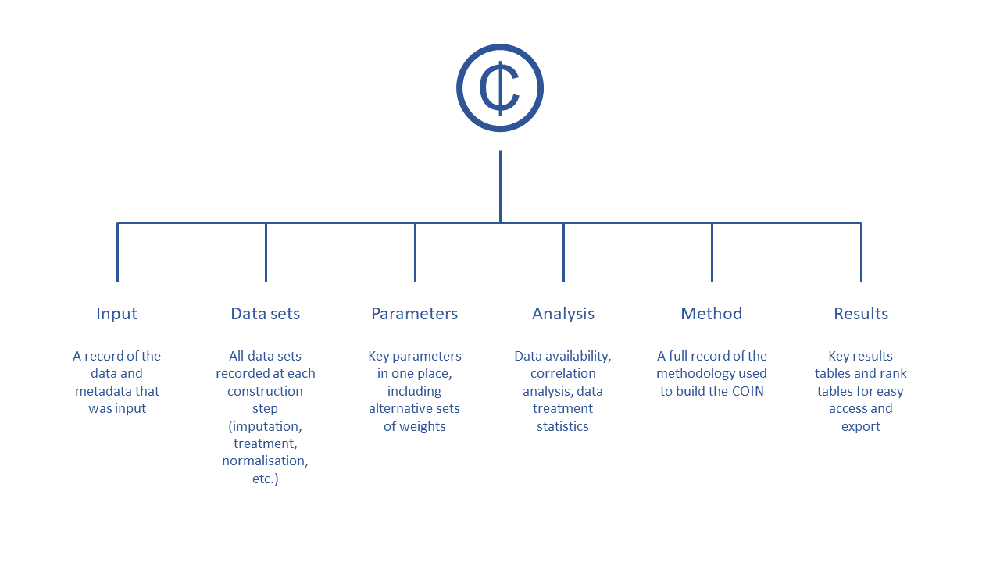

# COINs: the currency of COINr

Where possible COINr functions can be used as standalone functions, typically on data frames of indicator data, for operations such as normalisation, imputation and so on.

The full functionality of COINr is however harnessed by assembling the indicator data, and the structure of the index, into a "COIN". A COIN is a structured list, which neatly stores the various data sets, parameters, analyses and methodological decisions in one place. There are various reasons for doing this:

1. It simplifies operations because functions know where data and parameters are. Therefore, COINr operations typically follow a syntax of the form `COIN <- COINr_function(COIN, <methodological settings>)`, updating the COIN with new results and data sets generated by the function. This avoids having to repeatedly specify indicator names, structure, etc, as separate arguments. It's like putting a coin in a vending machine and getting a packet of crisps. Except you also get your coin back^[Depending on the function, you either get a packet of crisps (e.g. a plot or analysis), or your coin plus interest (an updated COIN with a new data set or analysis)].
2. It keeps things organised and avoids a workspace of dozens of variables.
3. It keeps a record of methodological decisions - this allows results to be easily regenerated following "what if" experiments, such as removing or changing indicators etc (see [Adjustments and comparisons]).

The logic of doing this will become clearer as you build your index. If you only want to use the COINr functions on data frames, you can probably skip this chapter.

To build a COIN, COINr has a dedicated function called `assemble()`. This is explained below in more detail.

## Inside a COIN

COINs are hierarchical lists, a bit like a folder system. In R they are sometimes called "lists of lists" or "nested lists". A COIN contains all the data, parameters, methodological choices and results of a composite indicator. It has a structure that looks like this:

```{r echo=F, fig.align = 'center', out.width = "100%", fig.cap = "Inside a COIN"}

```

The COIN is best explored using e.g. `View(ASEM)` in R Studio. It consists of six main sub-lists which are briefly described as follows (the dot in e.g. `.$Input` in the following refers to a generic COIN):

* `.$Input` is all input data and metadata that was initially used to construct the COIN.
* `.$Data` consists of data frames of indicator data at each construction step, e.g. `.$Data$Raw` is the raw data used to construct the COIN, `.$Data$Normalised` is the same data set after normalisation, and so on.
* `.$Parameters` contains parameters such as sets of weights, details on the number of indicators, aggregation levels, etc.
* `.$Method` is a record of the methodology applied to build the COIN. In practice, this records all the inputs to any COINr functions applied in building the COIN, for example the normalisation method and parameters, data treatment specifications, and so on. Apart from keeping a record of the construction, this also allows the entire results to be regenerated using the information stored in the COIN. This will be explained better in [Adjustments and comparisons].
* `.$Analysis` contains any analysis tables which are sorted by the data sets to which they are applied. This can be e.g. indicator statistics of any of the data sets found in `.$Data`, or correlations.
* `.$Results` contains summary tables of results, arranged and sorted for easy viewing.

When you first build the COIN, using the three input data frames explained in the next section, the COIN will only consist of the Input, Data, Parameters and possibly Method "folders" (sub-lists). As you construct the composite indicator, more things will be added to the COIN, for example extra data sets (denominated, normalised, aggregated), analysis (missing data, PCA, etc), and results (summary results tables).

Many analysis functions in COINr have an argument called `out2`, which specifies whether the result should be stored inside the COIN or output as a separate list or data frame.

It is worth exploring the contents of the COIN as it is built to understand where things are kept. A couple of things to keep in mind are:

1. One good reason to store things inside the COIN is that if you plan to export the results to Excel at any point, you can use the `coin2Excel()` function to export (almost) everything inside the COIN in one command. This includes all data sets, analysis tables and results tables.
2. A COIN is a list that has been labelled as a "COIN" using R's `class()` function, and has no hard restrictions on its structure. That means you can edit it as you would with any other list. The implications of this are:
    (a) You can also store other things in the COIN if you want, and add folders and lists to it, but,
    (b) You have to be careful editing it, because COINr functions expect things to be in certain places inside the COIN. So if you delete something, for example, some COINr functions may not work.

## The three inputs

  To build a COIN, three ingredients (data frames) are needed to begin with, and are used as inputs to the `assemble()` function, which outputs a COIN^[It is likely that in the near future COINr will move to a more concise two data frame approach. Stay tuned.]. In short, they are the indicator data, the indicator metadata, and the aggregation metadata. Here, each will be explained separately. Inputting the data in the first place takes a little effort, because you have to get your data in a format that COINr understands, and you are required to specify many things. But once you have got your data assembled, COINr should do most of the hard work, so hang in there!
  
How you actually create these data frames is up to you. If your data is coming from Excel, it may be easiest to assemble these data frames (tables) manually in Excel and then read directly into R. Alternatively, you may wish to create them from scratch in R (an advantage here could be that you can source data directly from APIs, and have a fully reproducible data pipeline), or you may have yet a different approach.

### Indicator data

The indicator data is a data frame which, shockingly, specifies the data for the indicators. However, it can do more than that, and also some rules have to be followed. The easiest way to explain is to start with an example.

```{r}
library(COINr6)
head(ASEMIndData[1:8])
head(ASEMIndData[9:16])
```

COINr comes prepackaged with some example data - here we are looking at indicator data from the [ASEM Sustainable Connectivity Portal](https://composite-indicators.jrc.ec.europa.eu/asem-sustainable-connectivity/), which has an indicator data set covering 51 Asian and European countries.

The first thing to notice is that each row is an observation (here, a country), and each column is a variable (mostly indicators, but also other things). Look at the structure of the data frame, working from left to right:

* `UnitName` [**required**] gives the name of each unit. Here, units are countries, so these are the names of each country.
* `UnitCode` [**required**] is a unique code assigned to each unit (country). This is very important, and is the main "reference" inside COINr for units. If your units are countries, I recommend using [ISO Alpha-3 codes](https://en.wikipedia.org/wiki/ISO_3166-1_alpha-3), because these are recognised by COINr for generating maps. It also makes data processing generally easier. For converting names to codes and vice versa, the [countrycode package](https://github.com/vincentarelbundock/countrycode) is extremely handy.
* `Group_*` [optional] Any column name that starts with `Group_` is recognised as a group column rather than an indicator. You don't have to have any groups, but some COINr functions support specific operations on groups (e.g. imputation within group, some charts also recognise groups). You can have as many group columns as you want.
* `Year` [optional] gives the reference year of the data. This allows you to have multiple years of data, for example, you can have a value for a given country for 2018, and another value for the same country for 2019, and so on. Like groups, this feature is not yet fully developed in COINr, but the `assemble()` function has the possibility to select years of data and impute by latest year (see below).
* `Den_*`[optional] Any column names that begin with `Den_*` are recognised as *denominators*, i.e. indicators that are used to scale other indicators. These are used in COINr's `denominate()` function.
* Finally, any column that begins with `x_` will be ignored and passed through. This is not shown in the data set above, but is useful for e.g. alternative codes or other variables that you want to retain. 

*Any remaining columns that do not begin with `x_` or use the other names in this list are recognised as indicators.*

You will notice that all column (variable/indicator) names use short codes. This is to keep things concise in tables, rough plots etc. Indicator codes should be short, but informative enough that you know which indicator it refers to (e.g. "Ind1" is not so helpful). In some COINr plots, codes are displayed, so you might want to take that into account. In any case, the full names of indicators, and other details, are also specified in the indicator metadata table - see the next section.

Some important rules and tips to keep in mind are:

* The following columns are *required*. All other columns are optional (they can be excluded):
  - UnitCode
  - UnitName (if you don't have separate names you can just replicate the unit codes)
  - At least one indicator column
* Columns don't have to be in any particular order, columns are identified by names rather than positions.
* You can have as many indicators and units as you like.
* Indicator codes and unit codes must have unique names. You can't use the same code twice otherwise bad things will happen.
* Avoid any accented characters or basically any characters outside of English - this can sometimes cause trouble with encoding.
* Column names are case-sensitive. Most things in COINr are built to have a degree of flexibility where possible, but *column names need to be written exactly as they appear here for COINr to recognise them*.,

### Indicator metadata

The second data frame you need to input specifies the *metadata* of each indicator. This serves two purposes: first, to give details about each indicator, such as its name, its units and so on; and second, to specify the structure of the index. Here's what this looks like, for our example ASEM data set:

```{r}
head(ASEMIndMeta)
```

Notice that here each row is an indicator (as opposed to `IndData` where columns represented indicators), and the columns specify attributes of indicators. This is to keep the data in a "tidy" format. Working through the columns one by one:

* `IndName` [**required**] This is the full name of the indicator, which will be used in display plots.
* `IndCode`[**required**] A reference code for each indicator. These *must be the same codes as specified in the indicator metadata*. The codes must also be unique.
* `Direction` [**required**] The "direction" of each indicator - this takes values of either 1 or -1 for each indicator. A value of 1 means that higher values of the indicator correspond to higher values of the index, whereas -1 means the opposite.
* `IndWeight` [**required**] The initial weights assigned to each indicator. Weights are relative within each aggregation group and do not need to sum to one (they will be re-scaled to sum to one within each group by COINr).
* `Denominator` [**optional**] These should be the indicator codes of one of the denominator variables for each indicator to be denominated. E.g. here "Den_Pop" specifies that the indicator should be denominated by the "Den_Pop" indicators (population, in this case). For any indicators that do not need denominating, just set `NA`. Denominators can also be specified later, so if you want you can leave this column out. See [Denomination] for more information.
* `IndUnit` [**optional**] The units of the indicator. This helps for keeping track of what the numbers actually mean, and can be used in plots.
* `Target` [**optional**] Targets associated with each indicator. Here, artificial targets have been generated which are 95% of the maximum score (accounting for the direction of the indicator). These are only used if the normalisation method is distance-to-target.
* `Agg*` [**required**] Any column name that begins with `Agg` is recognised as a column specifying the aggregation group, and therefore the structure of the index. Aggregation columns *should be in the order of the aggregation*, but otherwise can have arbitrary names.

Let's look at the aggregation columns in a bit more detail. Each column represents a separate aggregation level, so in the ASEM example here we have three aggregation levels - the pillars, the two sub-indexes, and the overall index. The entry of each column specifies which group each indicator falls in. So, the first column `Agg1` specifies the pillar of each indicator. Again, each aggregation group (pillar, sub-index or index) is referenced by a unique code.

The next column `Agg2`, gives the sub-index that the indicator belongs to. There is a bit of redundancy here, because obviously indicators in the same pillar must also belong to the same sub-index. Finally, `Agg3` specifies that all indicators belong to the index.

You can have as many `Agg` columns as you like, and the names don't have to be `Agg1` etc, but could be e.g. `Agg_Pillar`, `Agg_SubIndex`, etc. However, they *must* begin with `Agg`, otherwise COINr will not recognise them. And they *must* appear in the order of the aggregation, i.e. lowest level of aggregation first, then working upwards. This is in fact the only aspect of any of the input data frames that is dependent on order. It is not necessary even to aggregate to a single index -- COINr will aggregate as far as the structure specified here.

### Aggregation metadata

The final data input is the aggregation metadata, which is also the simplest. The aim is to specify the names of each aggregation group (so far only codes have been specified), and the weights of each aggregate for building higher levels. Here's our example for the ASEM data set:

```{r}
head(ASEMAggMeta)
```

This data frame simply consists of four columns, all of which are required for assembly:

* `AgLevel` [**required**] The aggregation level (where 1 is indicator level, 2 is the first aggregation level, and so on -- see Section \@ref(Sec:ContructingCIs))
* `Code` [**required**] The aggregation group codes. These codes must match the codes in the corresponding column in the indicator metadata aggregation columns.
* `Name` [**required**] The aggregation group names.
* `Weight` [**required**] The aggregation group weights. These weights can be changed later on if needed.

The codes specified here must be unique and not coincide with any other codes used for defining units or indicators. All columns are required, but do not need to be in a particular order.

## Putting everything together

Having got all your data in the correct format, you can finally build it into a COIN. From here, things start to get a bit easier. The function to build the COIN is called `assemble()`. This function takes the three data frames mentioned and converts them into a so-called *COIN*, which is a hierarchical list that is structured in a way that is recognised by all COINr functions. Let's run `assemble()` using the built-in data sets to show how it works.

```{r,collapse=T}
ASEM <- assemble(IndData = ASEMIndData, IndMeta = ASEMIndMeta, AggMeta = ASEMAggMeta)
```

The three inputs here are as follows:

* `IndData` which is the indicator data
* `IndMeta` which is the indicator metadata
* `AggMeta` which is the aggregation metadata

And this outputs a "COIN" which you can name as you want (here we have called it "ASEM"). There are some further arguments to `assemble()` which are not used here, and they are:

* `include` - this is a character vector of indicator codes (i.e. codes that are found in `IndData$IndCode`) which specifies which indicators to include out of the `IndData` and `IndMeta` inputs. By default, all indicators are included, but this gives the option to only include certain indicators, if for example, you have several alternative data sources.
* `exclude` - this an analogous character vector of indicator codes, but specifying which indicators to *exclude*, if any. Again, by default, nothing is excluded. This may be easier to specify when creating a subset of indicators.
* `preagg` - by default `assemble()` expects raw data to be input, which is then used to build the composite indicator. However, sometimes you may simply be analysing an already-built composite indicator. If `preagg = TRUE`, the `IndData` argument of `assemble()` can be a data frame of pre-aggregated data, i.e. columns for each indicator *plus* columns for each aggregate. In this case, you still need to supply `IndMeta` and `AggMeta`. An example of this is in [Appendix: Analysing a Composite Indicator Example].
* `use_year` - you can optionally supply `assemble()` with panel data, where there is a separate observation of each indicator, for each year (or other time interval). To do this, include a "Year" column in `IndData`. Currently, `assemble()` will only build a COIN for a single year of data, but `use_year` allows you to easily select this. So setting e.g. `use_year = 2018` will filter `IndData` to only include values from 2018 (if it exists).
* `impute_latest` - if panel data is supplied, you can optionally impute to the latest available observation by setting `impute_latest = TRUE`. This means if a unit has a missing value for a given indicator in the year specified by `use_year`, it will look backwards for previous observations of this data point and replace with the latest or `NA` if none is available.

The structure of the resulting COIN is explained in more detail in [Inside a COIN]). The logic of the COIN is that COINr functions can take all the data and parameters that they need from it, and you only have to specify some particular parameters of the function. Then, outputs, such as new data sets, are returned back to the COIN, which is added to and expanded as the analysis progresses.

Apart from building the COIN, `assemble()` does a few other things:

* It checks that indicator codes are consistent between indicator data and indicator metadata
* It checks that required columns, such as indicator codes, are present
* It returns some basic information about the data that was input, such as the number of indicators, the number of units, the number of aggregation levels and the groups in each level. This is done so you can check what you have entered, and that it agrees with your expectations.

In general, the job of `assemble()` is to construct a *valid* COIN which should not throw any errors later on. In other words, if you succeed in assembling your COIN, things should work fairly well from there on. Wherever possible `assemble()` tries to return helpful error messages to help you fix any problems with your inputs.

We can view a summary of the contents of the COIN at any time with the `print()` method for COINs. This can be called simply by naming the object on the command line:

```{r}
ASEM
```


## Moving on

Now that you have a COIN, you can start using all the other functions in COINr to their full potential. Most functions will still work on standalone data frames, so you don't *need* to work with COINs if you prefer not to.
