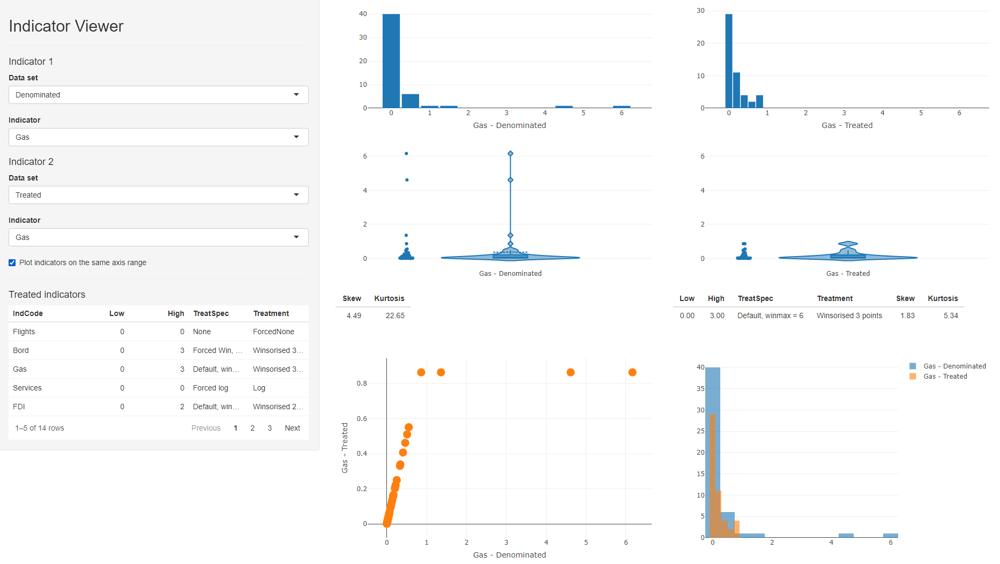

# Data Treatment

Data treatment is the process of altering indicators to improve their statistical properties, mainly for the purposes of aggregation.

Data treatment is a delicate subject, because it essentially involves changing the values of certain observations, or transforming an entire distribution. This entails balancing two opposing considerations:

* On the one hand, treatment should be used as sparingly as possible, because you are altering one or more known data points.
* On the other hand, *this is only done for the purposes of aggregation* (i.e. creating a composite score), and since composite indicators are normally presented with the index scores and original data accessible underneath, the underlying data would normally be presented in its original form.

Therefore, be careful, but also realise that data treatment is not unnerviving or unethical, it's simply another assumption in a statistical process. Like any other step or assumption though, any data treatment should be carefully recorded and its implications understood.

## Why treat data?

There can be many reasons to treat data, but in composite indicators the main reason is to remove outliers or adjust heavily-skewed distributions. Outliers can exist because of errors in measurement and data processing, and should always be double-checked. But often, they are simply a reflection of reality. Outliers and skewed distributions are common in economics. One has to look no further than the in-built ASEM data set, and the denominating variables of population, GDP, energy consumption and country area:

```{r DenomOutlierplots, message=F, warning=F}
plotIndDist(WorldDenoms)
```


To illustrate why this can be a problem, consider the following artificial example.

```{r outlier histogram, warning=F, message=F, collapse=T}
library(plotly)
# normally-distributed data
outlierdata <- rnorm(100)
# two outliers
outlierdata <- c(outlierdata, 10, 25)
# plot
plot_ly(x = outlierdata, type = "histogram")
```

Here we have the large majority of observations with values which are crammed into the bottom fifth of the scale, and two observations that are much higher, i.e. they are outliers. If we were to normalise this distribution using a min-max method scaled to [0, 100], for example, this would produce an indicator where the large majority of units have a very low score.

This might not reflect the narrative that you want to convey. It may be, for example, that values above the median are "good", and in this case, values in the 1.5-2.5 range are "very good". Two units have truly exception values, but that shouldn't take away from the fact that other units have values that are considered to be good.

The problem is that by normalising to [0, 100], these units with "very good" values will have normalised scores of around 20 (out of 100), which when compared to other indicators, is a "bad" score. And this will be reflected in the aggregated score. In summary, the outlying values are "dominating" the scale, which reduces the discriminatory power of the indicator.

A few things to consider here are that:

1. The outlier problem in composite indicators is mostly linked to the fact that you are aggregating indicators. If you are not aggregating, the outlying values may not be so much of a problem.
2. It might be that you *want* to keep the distribution as it is, and let the indicator be defined by its outliers. This will depend on the objectives of the index.
3. If you do wish to do something about the outlying values, there are two possibilities. One is to treat the data, and this is described in the rest of this chapter The second is to use a normalisation method that is less sensitive to outliers - this is dealt with in the [Normalisation] chapter.

## How to treat data

If you decide to treat the data before normalising, there are a two main options. 

### Winsorisation

The first is to *Winsorise* the data. Winsorisation involves reassigning outlying points to the next highest point, or to a percentile value. To do this manually, using the data from the previous section, it would look like this:

```{r Manual winz}
# get position of maximum value
imax <- which(outlierdata==max(outlierdata))
# reassign with next highest value
outlierdata[imax] <- max(outlierdata[-imax])
plot_ly(x = outlierdata, type = "histogram")

# and let's do it again
imax <- which(outlierdata==max(outlierdata))
outlierdata[imax] <- max(outlierdata[-imax])
plot_ly(x = outlierdata, type = "histogram")
```

And now we have arrived back to a normal distribution with no outliers, which is well-spread over the scale. Of course, this has come at the cost of actually moving data points. However keep in mind that this is only done for the purposes of aggregation, and the original indicator data would still be retained. A helpful way of looking at Winsorisation is that it is like capping the scale: it is enough to know that certain units have the highest score, without needing to know that they are ten times higher than the other units.

Clearly, outliers could also occur from the lower end of the scale, in which case Winsorisation would use the minimum values.

Notice that in general, Winsorisation does not change the shape of the distribution, apart from the outlying values. Therefore it is suited to distributions like the example, which are well-spread except for some few outlying values.

### Transformation

The second option is to transform the distribution, by applying a transformation that changes all of the data points and thus the overall shape of the distribution.

The most obvious transformation in this respect is to take the logarithm. Denoting $x$ as the original indicator and $x'$ as the transformed indicator, this would simply be:

$$ x' = \ln(x) $$
This is a sensible choice because skewed distributions are often roughly log-normal, and taking the log of a log-normal distrinbution results in a normal distribution. However, this will not work for negative values. In that case, an alternative is:

$$ x' = \ln(x- \text{min}(x)+a), \; \; \text{where}\; \; a = 0.01(\text{max}(x)-\text{min}(x)) $$
The logic being that by subtracting the minimum and adding something, all values will be positive, so they can be safely log-transformed. This formula is similar to that used in the COIN Tool, but with an adjustment. In the COIN Tool, $a=1$, which, depending on the range of the indicator, can give only a gentle and sometimes near-linear transformation. By setting $a$ to be a set percentage of the range, it is ensured that the shape of the transformation is consistent.

A general family of transformations are called the *Box-Cox* transformations. These are given as:

$$ x'(\lambda) =
    \begin{cases}
      \frac{x^\lambda-1}{\lambda} & \text{if}\ \lambda  \neq 0 \\
      \ln(x) & \text{if}\ \lambda = 0
    \end{cases} $$
    

In other words, a log transformation or a power transformation. The Box Cox transformation is often accompanied by an optimisation which chooses the $\lambda$ value to best approximate the normal distribution.

Comparing to Winsorisation, log transforms and Box Cox transforms perform the transformation on every data point. To see the effect of this, we can take the log of one of the denominator indicators in `WorldDenoms`, the national GDPs of over 200 countries in 2019.

```{r LogWorlddenoms, warning=F, message=F}
# make df with original indicator and log-transformed version
df <- data.frame(GDP = WorldDenoms$Den_GDP,
                 LogGDP = log(WorldDenoms$Den_GDP))
plotIndDist(df, type = "Histogram")

```

And there we see a beautiful normal distribution as a result.

## Data treatment in COINr

COINr data treatment has a number of options and gives the user a fairly high degree of control in terms of which kind of treatment should be applied, either for all indicators at once, or for individual indicators. We will first explore the default data treatment options that are applied to all indicators, then see how to make exceptions and specific treatment requests.

### Global treatment

The "default" treatment in COINr is similar to that applied in the [COIN Tool](https://knowledge4policy.ec.europa.eu/composite-indicators/coin-tool_en), and widely used in composite indicator construction. It follows a basic process of trying to Winsorise up to a specified limit, followed by a transformation if the Winsorisation does not sufficiently "correct" the distribution. In short, for each indicator it:

1. Checks skew and kurtosis values
2. If absolute skew is greater than a threshold (default 2) AND kurtosis is greater than a threshold (default 3.5):
    (a) Successively Winsorise up to a specified maximum number of points. If either skew or kurtosis goes below thresholds, stop. If after reaching the maximum number of points, both thresholds are still exceeded, then:
    (b) Perform a transformation
    
This is the default process, although individual specifications can be made for individual indicators - see the next section.

The data treatment function in COINr is called `treat()`. To perform a default data treatment, we can simply use the "COIN in, COIN out" approach as usual.

```{r Default treat ASEM, message=F, warning=F}
# build ASEM data set, up to denomination
ASEM <- assemble(IndData = COINr::ASEMIndData, IndMeta = COINr::ASEMIndMeta,
                 AggMeta = COINr::ASEMAggMeta)
ASEM <- denominate(ASEM, dset = "Raw")

# treat at defaults
ASEM <- treat(ASEM, dset = "Denominated", winmax = 5)

# Check which indicators were treated, and how
library(dplyr, quietly = T, verbose = F)
ASEM$Analysis$Treated$TreatSummary %>% filter(Treatment != "None")
```
The results of `treat()` are a new data set `.Data$Treated` with the treated data in it, and a details of the data treatment in `$Analysis$Treated`, including `TreatSummary` (shown above), which gives a summary of the data treatment specified and actually applied for each indicator. In this case, all indicators were successfully brought within the specified skew and kurtosis limits by Winsorisation, within the specified Winsorisation limit `winmax` of five points.

To see what happens if `winmax` is exceeded, we will lower the threshold to `winmax = 3`. Additionally, we can control what type of log transform should be applied when `winmax` is exceeded, using the `deflog` argument. We will set `deflog = "CTlog"` which ensures that negative values will not cause errors.

```{r Default treat ASEM lowered winmax}
# treat at defaults
ASEM <- treat(ASEM, dset = "Denominated", winmax = 3, deflog = "CTlog")

# Check which indicators were treated, and how
ASEM$Analysis$Treated$TreatSummary %>% filter(Treatment != "None")

# Compare before and after treatment
iplotIndDist2(ASEM, dsets = c("Denominated", "Treated"), icodes = "Services",
              ptype = "Histogram")
```

Now we can see from the table that the Services indicator has had a log transformation applied, and from the histograms that the skewness has been treated. The range of the indicator is now different, and this introduces negative values, however this will be anyway fixed in the normalisation step. The important thing here is the shape of the distribution.

Other options for `deflog` are "log" (a standard log transform), "GIIlog", which is a scaled log transformation used by the [Global Innovation Index](https://www.globalinnovationindex.org/), and "boxcox", which uses a Box-Cox transformation with the $\lambda$ parameter set by the `boxlam` argument to `treat()`. Optimised $\lambda$ values are not currently available in COINr, though this may be considered for future versions, along with custom transformation functions.

A further point to note is that Winsorisation can work in two ways in COINr, specified by the `winchange` argument. If set to `FALSE`, then Winsorisation works in the following way:

1. Perform an initial check of skew and kurtosis (call them $s_0$ and $k_0$). Only if **both** exceed thresholds, continue to 2. Otherwise no treatment is applied.
2. If $s_0$ is positive (usually the case), begin by Winsorising the highest value (assign the value of the second-highest point).
3. If $s_0$ is negative, begin by Winsorising the lowest value (assign the value of the second-lowest point).
4. If either skew or kurtosis thesholds are below thresholds, stop, otherwise
5. Go to 2. if $s_0$ was positive, or 3. if $s_0$ was negative.

Notably, the *direction* of the Winsorisation here is always the same, i.e. if $s_0$ was positive, Winsorisation will always be applied to the highest values. The only drawback here is that the sign of the skew can conceivably change during the Winsorisation process. For that reason, if you set `winchange = TRUE` (which is anyway default), the function will check after every Winsorised point to see whether to Winsorise high values or low values.

It might seem unlikely that the skew could change sign from one iteration to the next, *and* still remain outside the absolute threshold. But this has been observed to happen in some cases.

Finally, you can set the skewness and kurtosis threshold values to your favourite values using the `t_skew` and `t_kurt` arguments to `treat()`.

### Individual treatment

If you want more control over the treatment of individual indicators, this can be done by specifying the optional `individual` and `indiv_only` arguments. `individual` is a data frame which specifies the treatment to apply to specific indicators. It looks like this:

```{r}
# Example of "individual" data frame spec

individual = data.frame(
  IndCode = c("Bord", "Services", "Flights", "Tariff"),
  Treat = c("win", "log", "none", "boxcox"),
  Winmax = c(10, NA, NA, NA),
  Thresh = c("thresh", NA, NA, NA),
  Boxlam = c(NA, NA, NA, 2)
)
individual
```

The "IndCode" column is the list of indicators to apply a specific treatment. The "Treat" column dictates which treatment to apply: options are either Winsorise ("win"), or any of the `deflog` options described previously. The "Winmax" column gives the maximum number of points to Winsorise for that indicator. This value is only used if the corresponding row of "Treat" is set to "win". The "Thresh" column specifies whether to use skew/kurtosis thresholds or not. If "thresh", it uses the thresholds specified in the `thresh` argument of `treat()`. If instead it is set at `NA`, then it will ignore the thresholds and force the Winsorisation to Winsorise exactly `winmax` points. Finally, the "Boxlam" column allows an individual setting of the `boxlam` parameter if the corresponding entry of the "Treat" column is set to "boxcox". If `Individual` is specified, all of these columns need to be present regardless of the individual treatments specified. Where entries are not needed, you can simply put `NA`.

An important point is that if the treatment specified in the "Treat" column is forced upon the specified indicator, for example, if "CTlog" is specified, this will be applied, without any Winsorisation first. Conversely, if "win" is specified, this will be applied, without any subsequent log transform even if it fails to correct the distribution.

Finally, the `indiv_only` argument specifies if `TRUE`, ONLY the indicators listed in `individual` are treated, and the rest get no treatment. Otherwise, if `FALSE` then the remaining indicators are subject to the default treatment process.

Let's now put this into practice.


```{r Individual treatment}
ASEM <- treat(ASEM, dset = "Denominated", individual = individual,
              indiv_only = FALSE)
# Check which indicators were treated, and how
ASEM$Analysis$Treated$TreatSummary %>% filter(Treatment != "None")
```

And this shows how some indicators have had certain treatments applied. Of course here, the individual treatments have been chosen arbitrarily, and the default treatment would have sufficed. In practice, you would apply individual treatment for specific indicators for good reasons, such as excessive skew, or not wanting to treat certain indicators for conceptual reasons.

## Interactive visualisation

As we have seen in this chapter, it's essential to visualise your indicator distributions and check what treatment has been applied, and what the main differences are. This can be achieved with the plotting functions previously described, but could become cumbersome if you want to check many indicators.

COINr has an built-in Shiny app which lets you compare indicator distributions interactively. Shiny is an R package which allows you to build interactive apps, dashboards and gadgets that can run R code. Shiny is a powerful tool for interactively exploring, communicating and presenting results, and can be used to host apps on the web. If you would like to know more about Shiny, I would recommend the book [Mastering Shiny](https://mastering-shiny.org/index.html).

To run the indicator visualisation app, simply run `indDash(ASEM)`. This will open a window which should look like this:

```{r echo=F, fig.align = 'center', out.width = "100%", fig.cap = "indDash screenshot"}

```

The `indDash()` app is purely illustrative - it does not return anything back to R, but simply displays the distributions of the existing indicators.

In the side panel, all data sets that exist in the `.$Data` folder are accessible, as well as any denominators, if they exist. Any of the indicators from any of these data sets can be plotted against each other.

In the context of data treatment, this gives a fast way to check the effects of treating indicators. In the ASEM example, we can set the the data set of indicator 1 to "Denominated", and the data set of indicator 2 to "Treated". This will compare denominated against treated indicators, which is a sensible comparison since `treat()` was applied to `.Data$Denominated` in this case.

When a treated data set is selected, a table of treated indicators appears in the side panel - this lists all indicators that had treatment applied to them, and gives the details of the treatments applied. You can click on column headings to sort by values, and this can give an easy way to see which indicators were treated. You can then select an indicator of interest using the dropdown menus. In the screenshot above, we are comparing "Gas" in the denominated and treated data sets.

This gives several comparison plots: histograms of each indicator, violin plots, and a scatter plot of one indicator against the other, as well as overlaid histograms. As with any Plotly plot, any of these can be instantly downloaded using the camera button that appears when you hover over the plot. This might be useful for generating quick reports, for example.

Below the violin plots are details of the skew and kurtosis of the indicator, and details of the treatment applied, if any.

Finally, when comparing a treated indicator against its un-treated version, it can be helpful to check or un-check the "Plot indicators on the same axis range" box. Checking this box gives a like-for-like comparison which shows how the data points have moved, particularly useful in the case of Winsorisation. Unchecking it may be more helpful to compare the shapes of the two distributions.

While `indDash()` has specific features for treated data, it is also useful as a general purpose tool for fast indicator visualisation and exploration. It can help, for example, to observe trends and relationships between indicators and denominators, and will work with the aggregated data, i.e. to see how the index may depend on its indicators.
