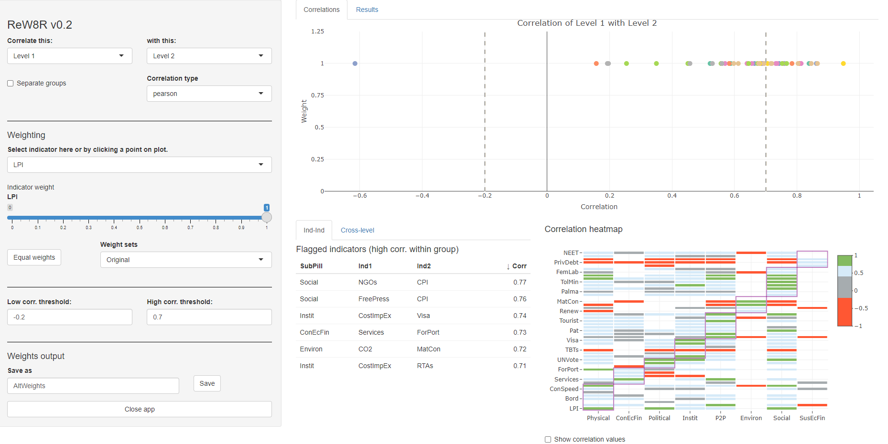
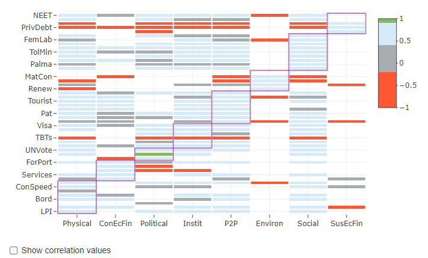
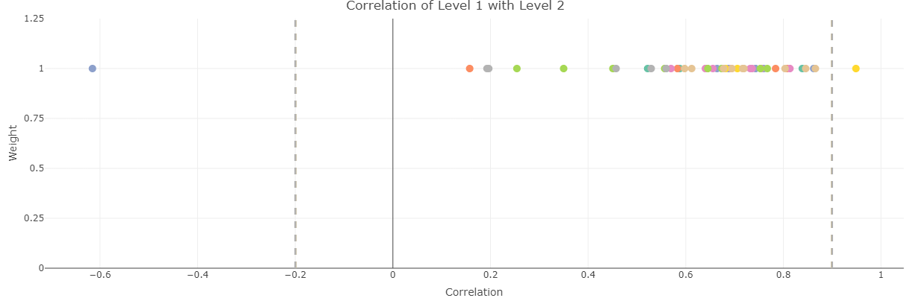
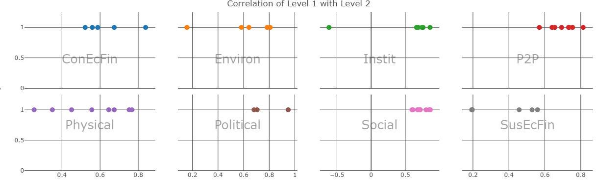

# Weighting

Strictly speaking, weighting comes before aggregation. However, in order to understand the *effects* of weights, we need to aggregate the index first.

Weighting in composite indicators is a thorny issue, which attracts considerable attention and is often one of the main focuses of critics. Weighting openly expresses a subjective opinion on the relative importance of each indicator relative to the others, and this opinion can easily be contested.

While this criticism definitely has some basis, weights can be viewed as a type of model parameter, and any model (e.g. engineering models, climate models, economic models) is full of uncertain parameters. In large models, these parameters are less evident since they are inside rather complex model code. Weights in composite indicators are easy to criticise since the model of a composite indicator is quite simple, usually using simple averages of indicator values.

That said, weights do need to be carefully considered, taking into account at least:

* The relative conceptual importance of indicators: is indicator A more, less, or equally important to indicator B?
* The statistical implications of the weights
* How to communicate the weights to end users

The last point is important if the index is for advocacy/awareness. Weights may be fine tuned to account for statistical considerations, but the result may make little sense to the public or the media.

Overall, weighting is a large topic which cannot be covered in detail here. Nevertheless, this chapter gives some introduction and points to further references.

## Approaches to weighting

Broadly, weighting approaches can be divided into those that are based on expert judgment, and those that are based on statistical considerations. Then there are approaches that combine the two.

### Equal weighting

The most common approach to weighting is simply to make all weights equal to one another. This may seem like an unjustifiable simplification, but in practice, experts often give near-equal weights when asked, and statistical approaches may give weights that are so unequal that it may be hard to justify them to stakeholders. This is why many composite indicators use equal weights. A further consideration is that the results of a composite indicator are often less sensitive to their weights than you might think.

That said, a number of other methods exist, some of which are discussed in the following sections.

### Budget allocation

Fundamentally, composite indicators involve breaking down a complex multidimensional concept into sub-concepts, and possibly breaking those sub-concepts down into sub-sub-concepts, and so on. Generally, you keep doing this until you arrive at the point where the (sub-)^n-concepts are sufficiently specific that they can be directly measured with a small group of indicators.

Regardless of the aggregation level that you are at, however, some of the indicators (or aggregates) in the group are likely to be more or less important to the concept you are trying to measure than others. 

Take the example of university rankings. One might consider the following indicators to be relevant to the notion of "excellence" for a university:

* Number of publications in top-tier journals (research output)
* Teaching reputation, e.g. through a survey (teaching quality)
* Research funding from private companies (industry links)
* Percentage of international students (global renown)
* Mean earning of graduates (future prospects of students)

These may all be relevant for the concept, but the relative importance is definitely debatable. For example, if you are a prospective student, you might prioritise the teaching quality and graduate earnings. If you are researcher, you might priorities publications and research funding. And so on. The two points to make here are:

1. Indicators are often not equally important to the concept, and
2. Different people have different opinions on what should be more or less important.

Bringing this back to the issue of weights, it is important to make sure that the relative contributions of the indicators to the index scorers reflect the intended importance. This can be achieved by changing the weights attached to each indicator, and the weights of higher aggregation levels.

How then do we understand which indicators should be the most important to the concept? One way is to simply use our own opinion. But this does not reflect a diversity of viewpoints.

The *budget allocation method* is a simple way of eliciting weights from a group of experts. The idea is to get a group of experts on the concept, stakeholders and end-users, ideally from different backgrounds. Then each member of the group is given 100 "coins" which they can "spend" on the indicators. Members allocate their budget to each indicator, so that they give more of the budget to important indicators, and less to less important ones.

This is a simple way of distributing weight to indicators, in a way that is easy for people to understand and to give their opinions. You can take the results, and take the average weight for each indicator. You can even infer a weight-distribution over each indicator which could feed into an uncertainty analysis.

### Principle component analysis

A very different approach is to use principle component analysis (PCA). PCA is a statistical approach, which rotates your indicator data into a new set of coordinates with special properties.

One way of looking at indicator data is as data points in a multidimensional space. If we only have two indicators, then any unit can be plotted as a point on a two-dimensional plot, where the x-axis is the first indicator, and the y-axis is the second.

```{r}
Ind1 <- 35
Ind2 <- 60

plot(Ind1, Ind2, main = "World's most boring plot")
```

Each point on this beautiful base-R plot represents a unit (here we only have one).

If we have three indicators, then we will have three axes (i.e. a 3D plot). If we have more than three, then the point lives in a *hyperspace* which we can't really visualise.

Anyway, the main point here is that indicator data can be plotted as points in a space, where each axis (dimension) is an indicator.

What PCA does, is that it rotates the data so that the axes are no longer indicators, but instead are *linear combinations of indicators*. And this is done so that the first axis is the linear combination of indicators that explains the most variance. If this is not making much sense (and if this is the first time you have encountered PCA then it probably won't), I would recommend to look at one of the many visualisations of PCA on the internet, e.g. [this one](https://setosa.io/ev/principal-component-analysis/).

PCA is useful for composite indicators, because if you use an arithmetic mean, then you are using a linear combination of indicators. And the first principle component gives the weights that maximise the variance of the units. In other words, if you use PCA weights, you will have the best weights for discriminating between units, and for capturing as much information from the underlying indicators.

This sounds perfect, but the downside is that PCA weights do not care about the relative importance of indicators. Typically, PCA assigns the highest weights to indicators with the highest correlations with other indicators, and this can result in a very unbalanced combination of indicators. Still, PCA has a number of nice properties, and has the advantage of being a purely statistical approach.

### Weight optimisation

If you choose to go for the budget allocation approach, to match weights to the opinions of experts, or indeed your own opinion, there is a catch that is not very obvious. Put simply, weights do not directly translate into importance.

To understand why, we must first define what "importance" means. Actually there is more than one way to look at this, but one possible measure is to use the (nonlinear) correlation between each indicator and the overall index. If the correlation is high, the indicator is well-reflected in the index scores, and vice versa.

If we accept this definition of importance, then it's important to realise that this correlation is affected not only by the weights attached to each indicator, but also by the correlations *between indicators*. This means that these correlations must be accounted for in choosing weights that agree with the budgets assigned by the group of experts.

In fact, it is possible to reverse-engineer the weights either [analytically using a linear solution](https://doi.org/10.1111/j.1467-985X.2012.01059.x) or [numerically using a nonlinear solution](https://doi.org/10.1016/j.ecolind.2017.03.056). While the former method is far quicker than a nonlinear optimisation, it is only applicable in the case of a single level of aggregation, with an arithmetic mean, and using linear correlation as a measure. Therefore in COINr, the second method is used.

## Weighting tools in COINr

As seen in the chapter on [Aggregation], weights are used to calculate the aggregated data set, and are one of the inputs to the `aggregate()` function. These can either be directly specified as a list, or as a character string which points to one of the sets of weights stored under `.$Parameters$Weights`. There is no limit to the number of sets of weights that can be stored here. So how do we create new sets of weights?

### Manual weighting

The simplest approach is to make manual adjustments. First, make a copy of the existing weights.

```{r CopyWeights, message=F, warning=F}

library(COINr)
# quietly build data set
ASEM <- build_ASEM()

NewWeights <- ASEM$Parameters$Weights$Original

NewWeights
```

The structure of the weights is a list, with one element per aggregation level, and each element is a vector of weights for that level. For example here, `NewWeights[[1]]` is the indicator weights, `NewWeights[[2]]` is the pillar weights, and so on.

We can just directly modify this. Let's say we want to set the weight of the connectivity sub-index to 0.5.

```{r DownWeightConn}
NewWeights[[3]][1] <- 0.5

NewWeights
```

Remember that *weights are relative*, and are re-scaled to sum to 1 during aggregation. To actually use these weights, we can either (a) input them directly in the `aggregate()` function, or first attach them to the COIN and the call `aggregate()`, pointing to the new set of weights. The latter option seems more sensible because that way, all our sets of weights are neatly stored. Also, we can access this in the reweighting app as explained in the next section.

```{r ReAggregate}
# put new weights in the COIN
ASEM$Parameters$Weights$NewWeights <- NewWeights

# Aggregate again to get new results
ASEM <- aggregate(ASEM, agweights = "NewWeights")
```

Now the `ASEM` COIN contains the updated results using the new weights. 

### Interactive re-weighting with ReW8R

Re-weighting manually, as we have just seen, is quite simple. However, depending on your objectives, weighting can be an iterative process along the lines of:

1. Try a set of weights
2. Examine correlations
3. Check results, rankings
4. Adjust weights
5. Return to 1.

Doing this at the command line can be time consuming, so COINr includes a "re-weighting app" called `rew8r()` which lets you interactively adjust weights and explore the effects of doing so.

To run `rew8r()` you must have already aggregated your data using `aggregate()`. This is because every time weights are adjusted, `rew8r()` re-aggregates to find new results, and it needs to know *which* aggregation method you are using. So, with your pre-aggregated COIN at hand, simply run:

```{r rew8r, eval=F}
ASEM <- rew8r(ASEM)
```

At this point, a window/tab should open in your browser with the `rew8r()` app, which looks something like this:

```{r echo=F, fig.align = 'center', out.width = "100%", fig.cap = "rew8r() screenshot"}

```

This may look a little over-complicated to begin with, but let's go through it step by step.

#### Correlations

First of all, `rew8r()` is based around correlations. Why are correlations important? Because they give an idea of how each indicator is represented in the final index, and at other aggregation levels (see earlier discussion in this chapter).

The `rew8r()` app allows you to check the correlations of anything against anything else. The two dropdown menus in the top left allow you to select which aggregation level to correlate against which other. In the screenshot above, the indicators (Level 1) are being correlated against the pillars (Level 2), but this can be changed to any of the levels in the index (the first level should always be below the second level otherwise it can cause errors). You can also select which type of correlation to examine, either Pearson (i.e. "standard" correlation), Spearman rank correlation, or Kendall's tau (an alternative rank correlation).

The correlations themselves are shown in two plots - the first is the scatter plot in the upper right part of the window, which plots the *correlation* of each indicator in Level 1 on the horizontal axis with its parent in Level 2, against its *weight* (in Level 1) on the vertical axis. We will come back to this shortly.

```{r echo=F, fig.align = 'center', out.width = "100%", fig.cap = "Heatmap screenshot (in rew8r)"}

```

The second plot is a heatmap of the correlation matrix (between Level 1 and Level 2 in this case) which is shown in the lower right corner. This gives the correlation values between all the indicators/groups of each level as colours according to a discrete colour map. This colour map intends to highlight highly correlated indicators (green), as well as negative or low-correlated indicators (red). These thresholds can be adjusted by adjusting the low and high correlation threshold dropdown menus in the side panel (on the left). The aggregation groups are also shown as overlaid rectangles, and correlation values can be turned on and off using the checkbox below the heatmap. The point of this plot is to show at a glance, where there are very high or low correlations, possibly within aggregation groups. For example, indicators that are negatively correlated with their aggregation group can be problematic. Note that correlation heatmaps can also be generated independently of the app using the `plotCorr()` function - this is described more in the [Multivariate analysis] section.

Highly-correlated indicators are also listed in a table at the lower middle of the window. The "Ind-Ind" tab flags any indicators that are above the high correlation threshold, and within the same aggregation group (the aggregation level immediately above the indicator level). Note that this is  *not* dependent on the weights since it regards correlations between indicators only. The "Cross-level" tab instead gives a table which flags any correlations across the two levels selected in side panel, which are above the threshold.

#### Weighting

Let us now turn back to the scatter plot. The scatter plot shows the correlation values on the horizontal axis, but also shows the weight of each indicator or aggregate in the first level selected in the dropdown menu. The purpose here is to show at a glance the weighting, and to make adjustments. To adjust a weight, either click on one of the points in the plot (hovering will show the names of the indicators or aggregates), or select the indicator/aggregate in the dropdown menu in the side panel under the "Weighting" subsection. Then adjust the weight using the slider. Doing this will automatically update all of the plots and tables, so you can see interactively how the correlations change as a result.

```{r echo=F, fig.align = 'center', out.width = "100%", fig.cap = "Correlation scatter plot screenshots in rew8r()."}


```


Importantly, the scatter plot only shows correlations between each indicator/aggregate in the first level *with its parent* in the second selected level. When everything is plotted on one plot, this may not be so clear, so the "Separate groups" checkbox in the side panel changes the plot to multiple sub-plots, one for each group in the second selected level. This helps to show how correlations are distributed within each group.

The results of the index, in terms of ranks and scores of units, can be found by switching to the "Results" tab in the main window.

Other than adjusting individual weights, any set of weights that is stored in `.$Parameters$Weights` can be selected, and this will automatically show the correlations. The button "Equal weights" sets weights to be equal at the current level.

Finally, if  you have adjusted the weights and you wish to save the new set of weights back to the COIN, you can do this in the "Weights output" subsection of the side panel. The current set of weights is saved by entering a name and clicking the "Save" button. This saves the set of weights to a list, and when the app is closed (using the "Close app" button), it will return them to the updated COIN under `.$Parameters$Weights`, with the specified name. You can save multiple sets of weights in the same session, by making adjustments, and assigning a name, and clicking "Save". When you close the app, all the weight sets will be attached to the COIN. If you don't click "Close app", any new weight sets created in the session will be lost.

#### Remarks

The `rew8r()` app is something of a work in progress - it is difficult to strike a balance between conveying the relevant information and conveying too much information. In future versions, it may be updated to become more streamlined.

### Automatic re-weighting


## Final points

Weighting and correlations is a complex topic, which is important to explore and address. On the other hand, weighting and correlations are just one part of a composite indicator, and balancing and optimising weights probably not be pursued at the expense of building a confusing composite indicator that makes no sense to most people (depending on the context and application).
