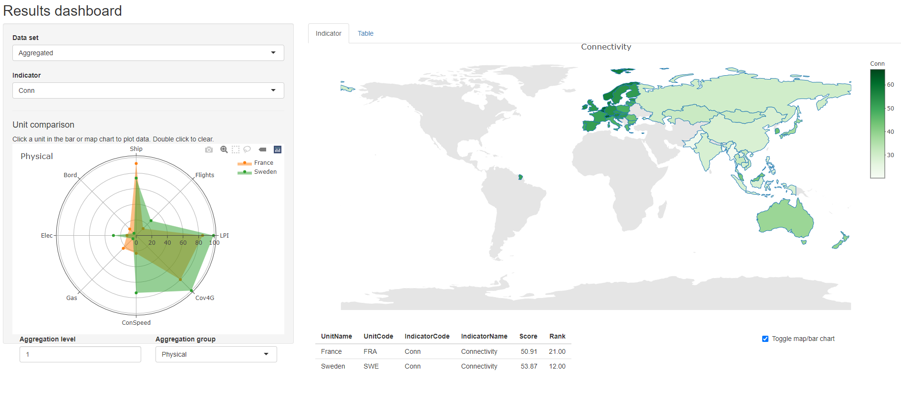

# Visualising results

The main results of a composite indicator are the aggregated scores and ranks. These can be explored and visualised in different ways, and the way you do this will depend on the context. For example, in building the index, it is useful to check the results at an initial stage, again after methodological adjustments, and so on through the construction process. Short static plots and tables are useful for concisely communicating results in reports or briefs. 

When the index is complete, it can be presented using a dedicated web platform, which allows users to explore the results in depth. Some interesting examples of this include:

* The [Lowy Asia Power Index](https://power.lowyinstitute.org/)
* The [Cultural and Creative Cities Monitor](https://composite-indicators.jrc.ec.europa.eu/cultural-creative-cities-monitor/performance-map)
* The [SDG Index and Dashboards](https://dashboards.sdgindex.org/map)

These latter platforms are not usually built in R, but in Javascript. However, COINr does have a simple results viewer that can be used for prototyping.

## Tables

To see the aggregated results, one way is to look in `.$Data$Aggregated`, which contains the aggregated scores, along with any grouping variables that were attached with the original data. However, this is not always convenient because the table can be quite large, and also the index itself will be the last column. You can of course manually select columns, but to make life easier COINr has a dedicated function, `getResults()`.

```{r resultsSummary}
library(COINr)
library(magrittr)

# build example data set
ASEM <- build_ASEM() %>% suppressMessages()

# get results table, top 10
getResults(ASEM) %>% head(10)
```

By default, `getResults()` gives a table of the highest level of aggregation (i.e. typically the index), along with the scores, and the ranks. Scores are rounded to two decimal places, and this can be controlled by the `nround` argument. To see all aggregate scores, we can change the `tab_type` argument:

```{r resultsAgg}
getResults(ASEM, tab_type = "Aggregates") %>%
  reactable::reactable()
```

Here, we have used the reactable package to display the full table interactively. Notice that the aggregation levels are ordered from the highest level downwards, which is a more intuitive way to read the table. Other options for `tab_type` are "Full", which shows all columns in `.$Data$Aggregated` (but rearranged to make them easier to read), and "FullWithDenoms", which also attaches the denominators. These latter two are probably mostly useful for further data processing, or passing the results on to someone else.

Often it may be more interesting to look at ranks rather than scores We can do this by setting `use = "ranks"`:

```{r resultsAggR}
getResults(ASEM, tab_type = "Aggregates", use = "ranks") %>%
  reactable::reactable()
```

Additionally to the `getResults()` function, the `iplotTable()` function also plots tables, but interactively (and indeed using the reactable package underneath). Like many other COINr functions it takes the `isel` and `aglev` arguments to select subsets of the indicator data. Moreover, it colours table cells, similar to conditional formatting in Excel.

As an example, we can request to see all the pillar scores inside the Connectivity sub-index. The function sorts the units by the first column by default. This function is useful for generating quick tables inside HTML reports.

```{r iplotTable_ASEM}
iplotTable(ASEM, dset = "Aggregated", isel = "Conn", aglev = 2)
```

Recall that since the output of this function is a reactable table, we can also edit it further by using reactable functions.

## Plots

Tables are useful but can be a bit dry, so you can spice this up using the bar chart and map options already mentioned in [Initial visualisation and analysis].

```{r ASEMindexbar}
iplotBar(ASEM, dset = "Aggregated", isel = "Index", usel = "GBR")
```

And here's a map:

```{r ASEMindexmap}
iplotMap(ASEM, dset = "Aggregated", isel = "Index")
```

The map and bar chart options here are very useful for quickly presenting results. However, if you want to make a really beautiful map, you should consider one of the many mapping packages in R, such as [leaflet](https://rstudio.github.io/leaflet/).

Apart from plotting individual indicators, we can inspect and compare unit scores using a radar chart. The function `iplotRadar()` allows the scores of one or more units, in a set of indicators, to be plotted on the same chart. It follows a similar syntax to `iplotTable()` and others, since it calls groups of indicators, so the `isel` and `aglev` arguments should be specified. Additionally, it requires a set of units to plot.

```{r radarASEM}
iplotRadar(ASEM, dset = "Aggregated", usel = c("CHN", "DEU"), isel = "Conn", aglev = 2)
```

Radar charts, which look exciting to newbies, but have are often grumbled about by data-vis veterans, should be used in the right context. In the first place, they are mainly good for *comparisons* between units - if you simply want to see the scores of one unit, a bar chart may be a better choice because it is easier to see the scores and to compare scores between one indicator and another. Second, they are useful for a smallish number of indicators. A radar chart with two or three indicators looks silly, and with ten indicators or more is hard to read. The chart above, with five indicators, is a clear comparison between two countries (in my opinion), showing that one country scores higher in all dimensions of connectivity than another, and the relative differences.

The `iplotRadar()` function is powered by Plotly, therefore it can be edited using Plotly commands. It is an interactive graphic, so you can add and remove units by clicking on the legend.

## Interactive exploration

COINr also offers a Shiny app called `resultsDash()` for quickly and interactively exploring the results. It features the plots described above, but in an interactive app format. The point of this is to give a tool which can be used to explore the results during development, and to demonstrate the results of the index in validation sessions with experts and stakeholders. It is not meant to replace a dedicated interactive platform. It could however be a starting point for a Shiny-based web platform.

To call the app, simply run:

```{r resultsApp, eval=F}
resultsDash(ASEM)
```

This will open a browser window or tab with the results dashboard app. The app allows you to select any of the data sets present in `.$Data`, and to plot any of the indicators inside either on a bar chart or map (see the toggle map/bar box in the bottom right corner). Units (i.e. countries here) can be compared by clicking on the bar chart or the map to select one or more countries -  this plots them on the radar chart in the bottom left. The indicator groups plotted in the radar chart are selected by the "Aggregation level" and "Aggregation group" dropdowns. Finally, the "Table" tab switches to a table view, which uses the `iplotTable()` function mentioned above.

```{r echo=F, fig.align = 'center', out.width = "100%", fig.cap = "resultsDash screenshot"}

```
