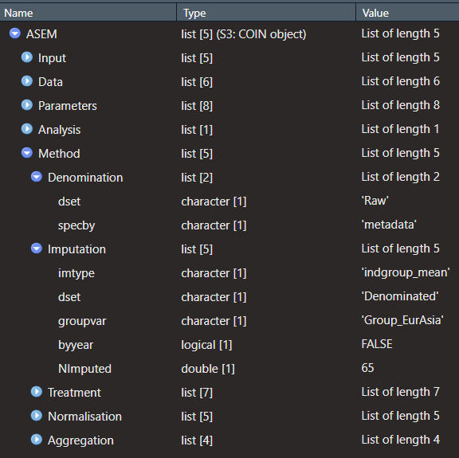

# Adjustments and comparisons

It's fairly common to make adjustments to the index, perhaps in terms of alternative data sets, indicators, methodological decisions, and so on. COINr allows you to (a) make fast adjustments, and (b) to compare alternative versions of the index relatively easily.

## Regeneration

One of the key advantages of working within the COINrverse is that (nearly) all the methodology that is applied when building a composite indicator (COIN) is stored automatically in a folder of the COIN called `.$Method`. To see what this looks like:

```{r MethodFolder}
# load COINr if not loaded
library(COINr)

# build example COIN
ASEM <- build_ASEM()

# look in ASEM$Method folder in R Studio...
```

```{r echo=F, fig.align = 'center', out.width = "60%", fig.cap = "Method folder in ASEM example"}

```

The easiest way to view it is by looking in the viewer of R Studio as in the screenshot above. Essentially, the `.$Method` folder has one entry for each COINr function that was used to build the COIN, and inside each of these folders are the arguments to the function that were input. Notice that the names inside `.$Method$denominate` correspond exactly to arguments to `denominate()`, for example.

Every time a COINr "construction function" is run, the inputs to the function are automatically recorded inside the COIN. Construction functions are any of the following seven:

Function            Description                                 
------------------  ---------------------------------------------
`assemble()`        Assembles indicator data/metadata into a COIN
`checkData()`       Data availability check and unit screening
`denominate()`      Denominate (divide) indicators by other indicators
`impute()`          Impute missing data using various methods
`treat()`           Treat outliers with Winsorisation and transformations
`normalise()`       Normalise data using various methods
`aggregate()`       Aggregate indicators into hierarchical levels, up to index

These are the core functions that are used to build a composite indicator, from assembling from the original data, up to aggregation.

One reason to do this is simply to have a record of what you did to arrive at the results. However, this is not the main reason (and in fact, it would be anyway good practice to make your own record by creating a script or markdown doc which records the steps). The real advantage is that results can be automatically regenerated with a handy function called `regen()`.

To regenerate the results, simply run e.g.:

```{r RegenSame}
ASEM2 <- regen(ASEM)
```

The `regen()` function reruns all functions that are recorded in the `.$Method` folder *in the order they appear in the folder*. In this example, it runs, in order, `assemble()`, `denominate()`, `impute()`, `treat()`, `normalise()`and `aggregate()`. This replicates exactly the results. But what is the point of that? Well, it means that we can make changes to the index, generally by altering parameters in the `.$Method` folder, and then rerun everything very quickly with a single command. This will be demonstrated in the following section. After that, we will also see how to compare between alternative versions of the index.

Before that, there is one extra feature of `regen()` which is worth mentioning. The `regen()` function only runs the seven construction functions as listed above. These functions are very flexible and should encompass most needs for constructing a composite indicator. But what happens if you want to build in an extra operation, or operations, that are outside of these seven functions?

It is possible to also include "custom" chunks of code inside the COIN. Custom chunks should be written manually using the `quote()` function, to a special folder `.$Method$Custom`. These chunks can be any type of code, but the important thing is to also know *when* to run the code, i.e. at what point in the construction process.

More specifically, custom code chunks are written as a named list. The **name** of the item in the list specifies *when* to perform the operation. For example, "after_treat" means to perform this immediately after the treatment step. Other options are e.g. "after_normalise" or "after_impute" -- in general it should be "after_" followed by a name of one of the names of the construction functions.

The corresponding **value** in the list should be an operation which *must* be enclosed in the `quote()` function. Clearly, the list can feature multiple operations at different points in construction.

This is slightly complicated, but can be clarified a bit with an example. Let's imagine that after Winsorisation, we would like to "reset" one of the Winsorised points to its original value. This is currently not possible inside the `treat()` function so has to be done manually. But we would like this operation to be kept when we regenerate the index with variations in methodology (e.g. trying different aggregation functions, weights, etc.).

We create a list with one operation: resetting the point after the treatment step.

```{r}
# Create list. NOTE the use of the quote() function!
custlist = list(after_treat = quote(ASEM$Data$Treated$Bord[ASEM$Data$Treated$UnitCode=="BEL"] <- ASEM2$Data$Imputed$Bord[ASEM$Data$Imputed$UnitCode=="BEL"]))

# Add the list to the $Method$Custom folder
ASEM2$Method$Custom <- custlist
```

Specifically, we have replaced the Winsorised value of Belgium, for the "Bord" indicator, with its imputed value (i.e. the value it had before it was treated).

Now, when we regenerate the COIN using `regen()`, it will insert this extra line of code immediately after the treatment step.

Using custom code may seem a bit confusing but it adds an extra layer of flexibility. It is however intended for small snippets of custom code, rather than large blocks of custom operations. If you are doing a lot of operations outside COINr, it may be better to do this in your own dedicated script or function, rather than trying to encode absolutely everything inside the COIN.

Before moving on, it's worth reiterating that regenerating a COIN runs the construction functions in the order they appear in the Method folder. That means that if you build an index with no imputation, for example, and then later decide to make a copy which now includes imputation, you would have to insert the `.Method$imputation` entry in the place where it should occur. An easy way to do this is using R's `append()` function. 

## Adjustments

Let us now explore how the COIN can be adjusted and regenerated. This will (hopefully) clarify why regenerating is a useful thing.

The general steps for adjustments are:

1. Copy the object
2. Adjust the index methodology or data by editing the `.$Method` folder and/or the underlying data
3. Regenerate the results
4. Compare alternatives

Copying the object is straightforward, and regeneration has been dealt with in the previous section. Comparison is also addressed in the following section. Here we will focus on adjustments and changing methodology.

### Adding/removing indicators

First of all, let's consider an alternative index where we decide to add or remove one or more  indicators. There are different ways that we could consider doing this.

A first possibility would be to manually create a new data frame of indicator data and indicator metadata, i.e. the `IndData` and `IndMeta` inputs for `assemble()`. This is fine, but we would have to start the index again from scratch and rebuild it.

A better idea is that when we first supply the set of indicators to `assemble()`, we include all indicators that we might possibly want to include in the index, including e.g. alternative indicators with alternative data sources. Then we build different versions of the index using subsets of these indicators. This allows us to use `regen()` and therefore to make fast copies of the index.

To illustrate, consider again the ASEM example. We can rebuild the ASEM index using a subset of the indicators by using the `include` or `exclude` arguments of the `assemble()` function. Because these are stored in `.$Method`, we can easily regenerate the new results.

```{r ASEMRemoveInd_Method}
# Make a copy
ASEM_NoLPIShip <- ASEM

# Edit method: exclude two indicators
ASEM_NoLPIShip$Method$assemble$exclude <- c("LPI", "Ship")

# Regenerate results (suppress any messages)
ASEM_NoLPIShip <- regen(ASEM_NoLPIShip, quietly = TRUE)
```

Note that, in the ASEM example, by default, `ASEM$Method$assemble` doesn't exist because the `include` or `exclude` arguments of `assemble()` are empty, and these are the only arguments to `assemble()` that are recorded in `.$Method$assemble`.

In summary, we have removed two indicators, then regenerated the results using exactly the same methodology as used before. Importantly, `include` and `exclude` operate *relative to the original data* input to `assemble()`, i.e. the data found in `.$Input$Original`. This means that if we now were to make a copy of the version excluding the two indicators above, and exclude another different indicator:

```{r ASEMRemoveInd_Method2}
# Make a copy
ASEM_NoBord <- ASEM_NoLPIShip

# Edit method: exclude two indicators
ASEM_NoBord$Method$assemble$exclude <- "Bord"

# Regenerate results
ASEM_NoBord <- regen(ASEM_NoBord, quietly = TRUE)

ASEM_NoBord$Parameters$IndCodes
```

...we see that "LPI" and "Ship" are once again present.

In fact, COINr has an even quicker way to add and remove indicators, which is a short cut function called `indChange()`. In one command you can add or remove indicators and regenerate the results. Unlike the method above, `indChange()` also adds and removes relative to the existing index, which may be more convenient in some circumstances. To demonstrate this, we can use the same example as above:

```{r ASEMIndChange}
# Make a copy
ASEM_NoBord2 <- indChange(ASEM_NoLPIShip, drop = "Bord", regen = TRUE)

ASEM_NoBord2$Parameters$IndCodes
```

And here we see that now, "Bord" has been excluded *as well as* "LPI" and "Ship".

### Other adjustments

We can make any methodological adjustments we want by editing any parameters in `.$Method` and then running `regen()`. For example, we can change the imputation method:

```{r ASEMAltImpute}
# Make a copy
ASEMAltImpute <- ASEM

# Edit .$Method
ASEMAltImpute$Method$impute$imtype <- "indgroup_median"

# Regenerate
ASEMAltImpute <- regen(ASEMAltImpute, quietly = TRUE)
```

We could also change the normalisation method, e.g. to use Borda scores:

```{r ASEMAltNorm}
# Make a copy
ASEMAltNorm <- ASEM

# Edit .$Method
ASEMAltNorm$Method$normalise$ntype <- "borda"

# Regenerate
ASEMAltNorm <- regen(ASEMAltNorm, quietly = TRUE)
```

and of course this extends to any parameters of any of the "construction" functions. We can even alter the underlying data directly if we want, e.g. by altering values in `.$Input$Original$Data`. In short, anything inside the COIN can be edited and then the results regenerated. This allows a fast way to make different alternative indexes and explore the effects of different methodology very quickly.

## Comparisons

A logical follow up to making alternative indexes is to try to understand the differences between these indexes. This can of course be done manually. But to make this quicker, COINr includes a few tools to quickly inspect the differences between different COINs.

In using these tools it should be fairly evident that comparisons are made between different versions of the same index. So the two indexes must have at least some units in common. The tools are intended for methodological variations of the type shown previously in this chapter - different aggregation, weighting, adding and removing indicators and so on. That said, since comparisons are made on units, it would also be possible to compare two totally different COINs, as long as they have units in common.

To begin with, we can make a simple bilateral comparison between two COINs. Taking two of the index versions created previously:

```{r}
compTable(ASEM, ASEMAltNorm, dset = "Aggregated", isel = "Index") %>%
  head(10) %>%
  knitr::kable()
```

The `compTable()` function allows a rank comparison of a single indicator or aggregate, between two COINs. The COINs must both share the indicator code which is assigned to `isel`. By default the output table (data frame) is sorted by the highest absolute rank change downwards, but it can be sorted by the other columns using the `sort_by` argument:

```{r}
compTable(ASEM, ASEMAltNorm, dset = "Aggregated", isel = "Index", sort_by = "RankCOIN1") %>%
  head(10) %>%
  knitr::kable()
```

Why use ranks as a comparison and not scores? As explained elsewhere in this documentation, a different normalisation method or aggregation method can result in very different scores for the same unit. Since scores have no units, the scale is in many ways arbitrary, but ranks are a consistent way of comparing different versions.

For comparisons between more than two COINs, the `compTableMulti()` function can be used.
