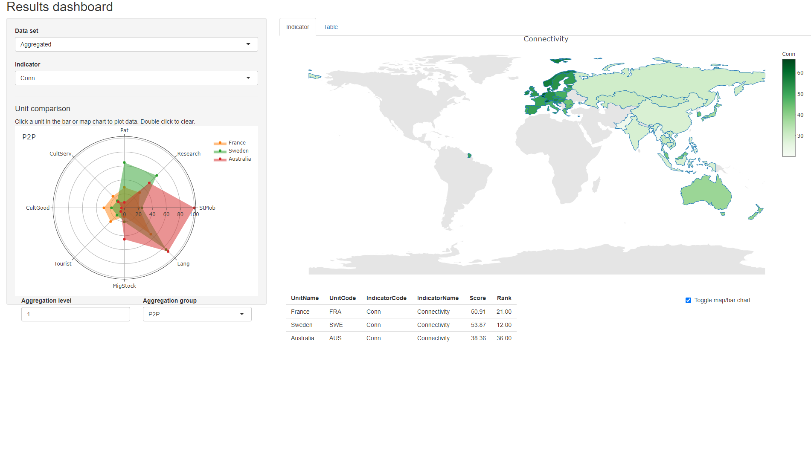

--- 
title: "Composite Indicator Development and Analysis in R with COINr"
author: "William Becker"
date: "`r Sys.Date()`"
site: bookdown::bookdown_site
output: bookdown::gitbook
documentclass: book
bibliography: [book.bib, packages.bib]
biblio-style: apalike
link-citations: yes
github-repo: bluefoxr/COINrDoc
description: "Composite indicators with COINr"
---

```{r, setup, include=FALSE}
knitr::opts_chunk$set(fig.width = 8, collapse = TRUE, warning = FALSE)
```

# Introduction

## Background

This documentation describes in detail the COINr package, which is an open source R package for developing and analysing composite indicators, developed by the European Commission's [Joint Research Centre](https://knowledge4policy.ec.europa.eu/composite-indicators/about_en). In fact, this is slightly more than technical documentation, and also gives some tips on composite indicator development along the way.

A *composite indicator* is an aggregation of indicators which aims to measure a particular concept. Composite indicators are typically used to measure complex and multidimensional concepts which are difficult to define, and cannot be measured directly. Examples include innovation, human development, environmental performance, and so on. Composite indicators are closely related to scoreboards, which are also groups of indicators aiming to capture a concept. However, scoreboards do not aggregate indicator values. Composite indicators also usually use a hierarchical structure which breaks the concept down into elements, sometimes known as sub-pillars, pillars, sub-indexes, dimensions, and so on.

COINr is currently still under development, therefore the package itself, and this documentation, are a work in progress but are being continually updated. You can find the latest version of COINr at its [GitHub repo](https://github.com/bluefoxr/COINr), and also the source code for this documentation [here](https://github.com/bluefoxr/COINrDoc).

## Installation

COINr is not yet on CRAN but can be installed via Github. First, install the `devtools` package if you don't already have it, then run:

```{r InstallCOINr, eval=FALSE}
devtools::install_github("bluefoxr/COINr")
```

This should directly install the package from Github, without any other steps. You may be asked to update packages. This might not be strictly necessary, so you can also skip this step.

At the time of writing (June 2021), the functionalities of the package are perhaps 90% complete. Roughly speaking, the features that are described in detail in this documentation are more or less complete and have survived an initial round of testing and checks. Any functions that are not described in detail here should be treated with more caution and it is likely that bugs would be encountered here and there. The entire package will need to beta tested before a more official “release”.

In case you do spot a bug, or have a suggestion, the best way is to [open an issue](https://github.com/bluefoxr/COINr/issues) on the repo. Otherwise, you can also just [email me](mailto:william.becker@bluefoxdata.eu).

## What does it do?

COINr is the first fully-flexible development and analysis environment for composite indicators and scoreboards. It is more than simply a collection of useful functions - it wraps up all data, methodology and analysis of a composite indicator into a single object called a "COIN". COINr functions are adapted to work with very few commands on COINs, but many will also work on data frames as well. This leads to a fast and neat environment for building and analysing composite indicators.

Using COINs, i.e. the *COINrverse approach*, enables the full feature set of COINr, because some functions only work on COINs - for example, exporting all results to Excel in one command, or running an uncertainty/sensitivity analysis. Indeed, COINr is built mainly for COINrverse use, but functions have been written with the flexibility to also accommodate independent use where possible.

The main features can be summarised as features for *building*, features for *analysis* and features for *visualisation and presentation*.

**Building features**:

* Flexible and fast development of composite indicators with no limits on aggregation levels, numbers of indicators, highly flexible set of methodological choices.
* Denomination by other indicators (including built in world denominators data set)
* Screening units by data requirements
* Imputation of missing data, by a variety of methods
* Data treatment using Winsorisation and nonlinear transformations
* Normalisation by more than ten methods, either for all indicators or for each individually
* Weighting using either manual weighting, PCA weights or correlation optimised weights. COINr also includes a reweighting app which explores the effects of weights on correlations.
* Aggregation of indicators using a variety of methods which can be different for each aggregation level.

**Analysis features:**

* Detailed indicator statistics, and data availability within aggregation groups
* Multivariate analysis, including quick functions for PCA, and a detailed correlation analysis and visualisation
* Easy "what if" analysis - very quickly checking the effects of adding and removing indicators, changing weights, methodological variations
* Full global uncertainty and sensitivity analysis which can check the impacts of uncertainties in weighting and many methodological choices

**Visualisation and presentation:**

* Statistical plots of indicators - histograms, violin plots, dot plots, scatter plots and more, including interactive html plots and an app for exploring indicator data
* Bar charts, stacked bar charts, maps, tables and radar charts for presenting indicator data and making comparisons between units
* Static and interactive correlation plots for visualising correlations between indicators and between aggregation levels
* An interactive app for visualising and presenting initial results
* Automatic generation of unit reports (e.g. country reports) using customisable R markdown templates

COINr also allows fast import from the [COIN Tool](https://knowledge4policy.ec.europa.eu/composite-indicators/coin-tool_en) and fast export to Excel.

In short, COINr aims to allow composite indicators to be developed and prototyped very quickly and in a structured fashion, with the results immediately available and able to be explored interactively. Although it is built in R, it is a high-level package that aims to make command simple and intuitive, with the hard work performed behind the scenes, therefore it is also accessible to less experienced R users.

## How to use this manual

COINr has many features, and it is unlikely you will want to read this manual from cover to cover. Roughly speaking, the chapters of this manual represent the major functions and groups of functions present in COINr. If you are looking for guidance on a specific function, simply look for the relevant chapter, or search for the function using the search box. You can also use `?function_name` in R for help on each function.

If you are building a composite indicator, the following chapters should be useful in particular:

* [COINs: the currency of COINr]
* [Normalisation]
* [Aggregation]
* [Appendix: Building a Composite Indicator Example]

Then you may wish to see chapters on [Foundations], [Initial visualisation and analysis], [Denomination], [Missing data and Imputation], [Data Treatment] and [Weighting] depending on what you want to do.

If you are analysing a composite indicator (and this may also be part of the construction process), some relevant chapters are:

* [Initial visualisation and analysis]
* [Multivariate analysis]
* [Adjustments and comparisons]
* [Sensitivity analysis]
* [Appendix: Analysing a Composite Indicator Example]

It is however worth browsing through the contents to pick out any further relevant chapters and sections that might be of interest.


## Demo

COINr is highly customisable, but equally allows composite indicator construction in a few commands. Taking the built-in ASEM dataset, we can assemble a composite indicator in a few steps.

```{r demo_assemble, collapse=T}
library(COINr)

# assemble basic composite indicator object from input data
ASEM <- assemble(IndData = ASEMIndData,
                 IndMeta = ASEMIndMeta,
                 AggMeta = ASEMAggMeta)
```

Here, we have loaded the COINr package, and assembled a so-called “COIN”, which is a structured object used universally within COINr. It contains a complete record of all data sets, parameters, methodological choices, analysis and results generated during the construction and analysis process. A COIN is initially assembled by supplying a table of indicator data, a table of indicator metadata (which also specifies the structure of the index), and a table of aggregation metadata. More details can be found in the chapter on [COINs: the currency of COINr].

Currently, the COIN (composite indicator) only contains the input data set and other metadata. To actually get the aggregated results (i.e. and index), we have to denominate, normalise and aggregate it. These operations are performed by dedicated functions in COINr.


```{r demo_construct, collapse=T}

# denominate data using specifications in ASEMIndMeta
ASEM <- denominate(ASEM, dset = "Raw")
# normalise data
ASEM <- normalise(ASEM, dset = "Denominated")
# Aggregate normalised data
ASEM <- aggregate(ASEM, dset = "Normalised")

```

Of course, there are many ways to aggregate data, and other steps could be performed before aggregating, such as (multivariate) analysis, data treatment and so forth. Here, we have simply taken three basic steps.

Each of the functions generates a new data set – here, respectively “Denominated”, “Normalised” and “Aggregated” data sets which are added to and stored within the COIN. Although in the example here the default specifications have been used, the functions have many options, and can be directed to operate on any of the data sets within the COIN. Details on this are left to later chapters in this book.

At this point, let us examine some of the outputs in the COIN. First, we may want to see the index structure:

```{r, warning=F, message=F}
plotframework(ASEM)
```

In the online version of this documentation, this plot appears as an interactive “HTML widget” which can be embedded into HTML documents. COINr leverages existing R packages, and interactive graphics (like that of Figure 6) are generated using bindings to the plotly package, which is based on Javascript libraries. Static graphics are largely produced by the ggplot2 package.

The framework plot is called a “sunburst plot” and summarises the structure of the index and the relative weight of each indicator in each aggregation level and the index.

We can also get indicator statistics in table format:

```{r, warning=F, message=F}
library(reactable)
library(magrittr)
ASEM <- getStats(ASEM, dset = "Raw")
ASEM$Analysis$Raw$StatTable %>%
  reactable::reactable(defaultPageSize = 5, highlight = TRUE, wrap = F)
```

Again, this table is an presented as an interactive HTML table and is easier explored using the online version of this book. In short, `getstats()` provides key statistics on each indicator, relating to data availability, outliers, summary statistics such as mean, median, skew, kurtosis, and so on. This can be applied to any data set within the COIN.

Indicator distributions can also be easily plotted:

```{r, warning=F, message=F}
plotIndDist(ASEM, type = "Violindot", icodes = "Political")
```

Finally, results can be visualised and explored in an interactive dashboard. This can be useful as a rapid prototype of the index. The app may even be hosted online, or can be used as the basis for a more customised indicator visualisation platform. Here, a basic screenshot is provided.

```{r echo=F, fig.align = 'center', out.width = "100%", fig.cap = "Results dashboard screenshot"}

```

Clearly, this is not meant to replace a dedicated composite indicator visualisation site, but is a fast first step.
